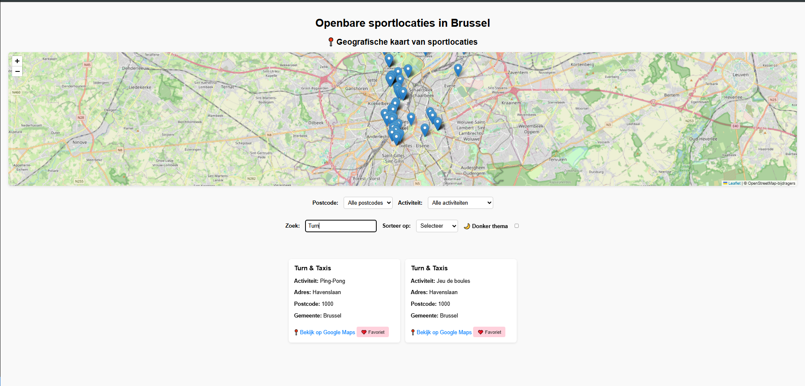
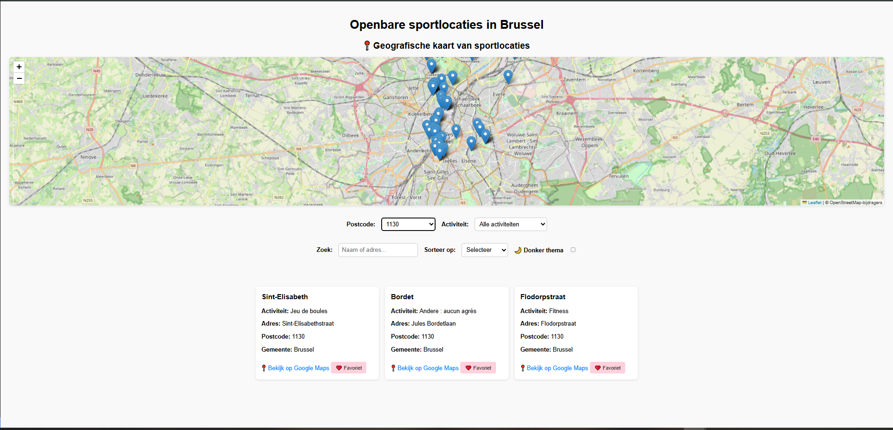
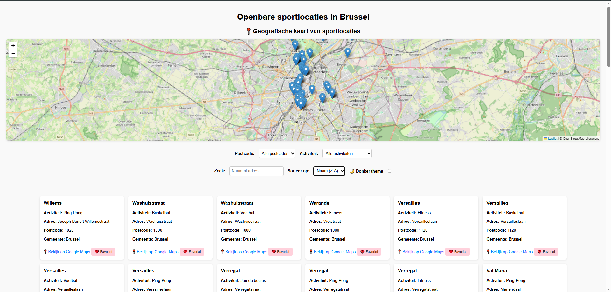
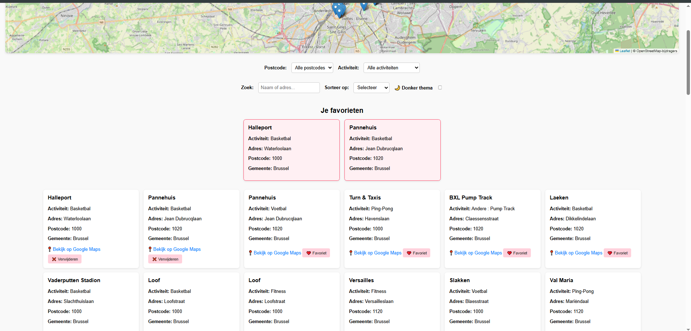
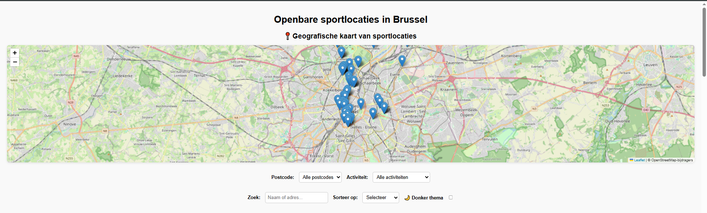
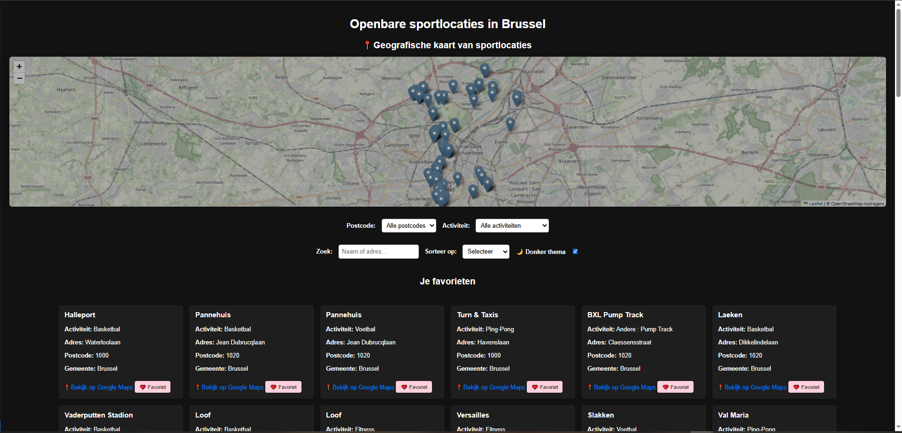

# BrusselsExplorer

Een interactieve webapplicatie gebouwd met **HTML**, **CSS** en **JavaScript** die openbare sportlocaties in Brussel toont via de open data API van [opendata.brussels.be](https://opendata.brussels.be/).

---

## Functionaliteiten

-  Live data ophalen via de publieke API van Brussel
-  Filteren op postcode en activiteit
-  Zoeken op naam of adres (pas actief vanaf 2 tekens)
-  Sorteren op naam (A-Z of Z-A)
-  Favorieten opslaan in `localStorage`
-  Donker thema toggle met voorkeur die bewaard blijft
-  Kaart met Leaflet.js (alle locaties met marker)
-  Volledig responsief ontwerp
-  Scroll-melding onderaan via de `IntersectionObserver` API
-  Formuliervalidatie op het zoekveld (met melding vanaf < 2 tekens)

---

## Technische vereisten

### DOM manipulatie  
- **Elementen selecteren**  
  `document.getElementById(...)` o.a. in `populateFilters()`, `applyFilters()`, `setupSearchValidation()`  
  → `script.js` *Lijnen*: 27, 28, etc.

- **Elementen manipuleren**  
  `innerHTML`, `appendChild()` in `renderLocations()`, `renderFavorites()`, `setupObserver()`  
  → `script.js` *Lijnen*: 57, 85, etc.

- **Events aan elementen koppelen**  
  `addEventListener()` in `populateFilters()`, `setupTheme()`, `setupSearchValidation()`  
  → `script.js` *Lijnen*: 48–51  

---

### Modern JavaScript  
- **Gebruik van constanten**  
  `const` gebruikt voor `apiURL`, DOM-elementen en elementen zoals `card`, `favBtn`, `marker`  
  → `script.js` *Lijnen*: 1, 27, etc. 

- **Template literals**  
  Voor dynamische HTML en Leaflet popups  
  → `script.js` *Lijnen*: 67 

- **Iteratie over arrays**  
  `.forEach()` in `populateFilters()`, `renderLocations()`, `renderFavorites()`, `initMap()`  
  → `script.js` *Lijnen*: 34

- **Array methodes**  
  `.map()`, `.filter()`, `.sort()`, `.includes()`  
  → `script.js` *Lijnen*: 31 

- **Arrow functions**  
  Callbacks  
  → `script.js` *Lijnen*: 114

- **Conditional (ternary) operator**  
  Bijvoorbeeld: `favBtn.textContent = ... ? ... : ...`  
  → `script.js` *Lijnen*: 78 

- **Callback functions**  
  In `.forEach()` en `addEventListener()`  
  → `script.js` *Lijnen*: 48, 173  

- **Promises**  
  In `fetch()` en `.json()` returnen Promises  
  → `script.js` *lijnen: 14-15

- **Async & Await**  
  In `fetchData()`  
  → `script.js` *Lijnen*: 11–23  

- **Observer API**  
  Gebruikt in `setupObserver()`  
  → `script.js` *Lijnen*: 150–163  

---

### Data & API  
- **Fetch om data op te halen**  
  In `fetchData()` met `fetch()`  
  → `script.js` *Lijnen*: 13  

- **JSON manipuleren en weergeven**  
  `.json()` en `data.results` verwerkt en weergegeven  
  → `script.js` *Lijnen*: 14–15

---

### Opslag & validatie  
- **Formulier validatie**  
  Validatie op zoekveld via `setCustomValidity()`  
  → `script.js` *Lijnen*: 116 
  Extra logica bij filtering pas vanaf 2 tekens  
  → `script.js` *Lijnen*: 100  

- **Gebruik van LocalStorage**  
  `getFavorites()`, `saveFavorites()`, `toggleFavorite()`  
  → `script.js` *Lijnen*: 124

---

### Styling & layout  
- **Basis HTML layout**  
  Semantische structuur met filters en resultatenblokken  
  → *Bestand*: `index.html`

- **Basis CSS**  
  Volledige styling met flexbox, kleuren, schaduw, etc.  
  → *Bestand*: `style.css`

- **Gebruiksvriendelijke elementen**  
  - Verwijder/favoriet-knop  
    → `script.js` *Lijnen*: 78  
  - Icoontjes zoals ❤️, ❌, 📍  
    → `script.js` *Lijnen*: 78 
  - Donker thema toggle  
    → `script.js` *Lijnen*: 193 

---

##  Gebruikte API

- **API-platform**: [Open Data Brussels](https://opendata.brussels.be)
- **Dataset**: [espaces-sportifs-publics-vbx](https://opendata.brussels.be/explore/dataset/espaces-sportifs-publics-vbx/information/)
- **API JSON-link**:  
  [`https://opendata.brussels.be/api/explore/v2.1/catalog/datasets/espaces-sportifs-publics-vbx/records?limit=100`](https://opendata.brussels.be/api/explore/v2.1/catalog/datasets/espaces-sportifs-publics-vbx/records?limit=100)

---

##  Installatie & gebruik

1. **Repository klonen**:
   ```bash
   git clone https://github.com/RiyadDevv/DynamicWebExamen.git
   ```

2. **Projectmap openen**:
   ```bash
   cd DynamicWebExamen
   ```

3. **Open in Visual Studio Code**

4. **Live Server starten**  
   → Klik met rechtermuisknop op `index.html` > Kies **Open with Live Server**

---

## Screenshots

### Hoofdscherm met filters en zoekfunctie




### Favorieten


### Kaartweergave met markers


### Donker thema


---

##  Team & taakverdeling

###  Riyad El Bahri

Werkstudent, geen team.

---

##  Gebruikte bronnen

- **Open Data Brussels API**  
  ↳ [Dataset](https://opendata.brussels.be/explore/dataset/espaces-sportifs-publics-vbx/information)  
  ↳ [API JSON endpoint](https://opendata.brussels.be/api/explore/v2.1/catalog/datasets/espaces-sportifs-publics-vbx/records?limit=100)

- **Leaflet.js documentatie**  
  ↳ [Quick Start Guide](https://leafletjs.com/examples/quick-start/)  
  ↳ [API Reference](https://leafletjs.com/reference.html)

- **MDN Web Docs**  
  ↳ [Fetch API](https://developer.mozilla.org/en-US/docs/Web/API/Fetch_API)  
  ↳ [DOM Selectors](https://developer.mozilla.org/en-US/docs/Web/API/Document/querySelector)  
  ↳ [Intersection Observer](https://developer.mozilla.org/en-US/docs/Web/API/Intersection_Observer_API)  
  ↳ [LocalStorage](https://developer.mozilla.org/en-US/docs/Web/API/Window/localStorage)  
  ↳ [HTML Form Validation](https://developer.mozilla.org/en-US/docs/Learn/Forms/Form_validation)

- **Emoji gebruik in README & UI**  
  ↳ [Emojipedia](https://emojipedia.org/)  
  ↳ [Markdown Emoji Cheat Sheet](https://github.com/ikatyang/emoji-cheat-sheet)

- **AI  tool**  
Gebruikt voor:
  - Aanpassing van `setupSearchValidation()` (validatie vanaf 2 tekens)
  - Verbetering van leesbare JS-structuur en best practices
  - Uitleg en integratie van `IntersectionObserver`
  - Uitleg Leaflet-map

- **README good practice**  
  ↳ [How to write a good README](https://github.com/banesullivan/README/blob/main/README.md)

---
